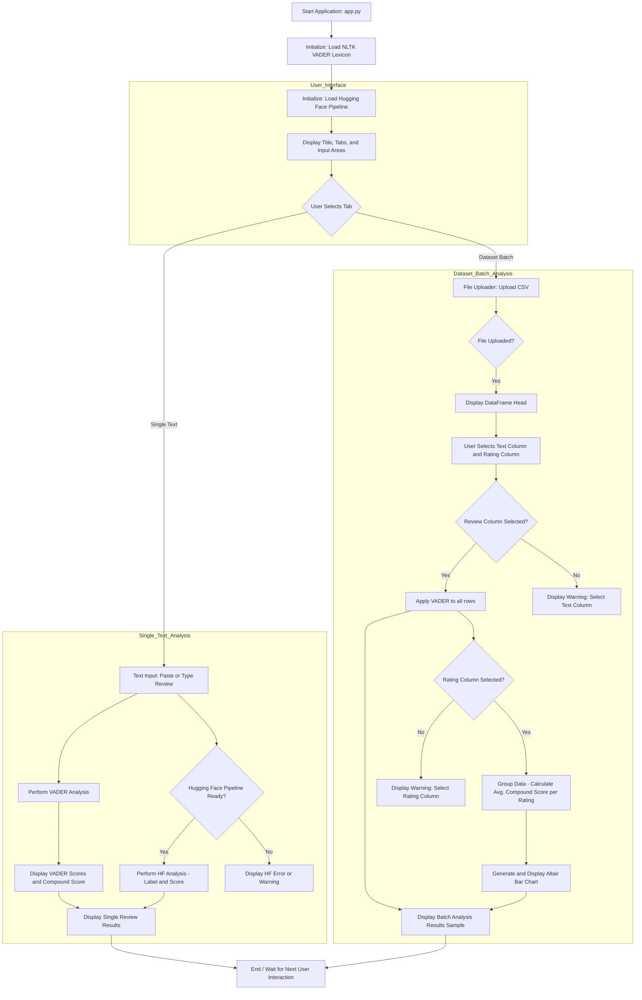

# analysis_Positive_negatice_ratings

demo link : https://analysispositivenegaticeratings-maruti.streamlit.app/

```mermaid
graph TD
    Start[Start Application: app.py] --> InitVADER[Initialize: Load NLTK VADER Lexicon]
    InitVADER --> InitHF[Initialize: Load Hugging Face Pipeline]

    subgraph User_Interface
        UI[Display Title, Tabs, and Input Areas]
        InitHF --> UI
        UI --> SelectTab{User Selects Tab}
    end

    subgraph Single_Text_Analysis
        SelectTab -- Single Text --> InputText[Text Input: Paste or Type Review]
        InputText --> VADER[Perform VADER Analysis]
        VADER --> DisplayVADER[Display VADER Scores and Compound Score]

        InputText --> HFReady{Hugging Face Pipeline Ready?}
        HFReady -- Yes --> HFAnalysis["Perform HF Analysis - Label and Score"]
        HFReady -- No --> HFError[Display HF Error or Warning]

        DisplayVADER --> ShowResult[Display Single Review Results]
        HFAnalysis --> ShowResult
    end

    subgraph Dataset_Batch_Analysis
        SelectTab -- Dataset Batch --> UploadCSV[File Uploader: Upload CSV]
        UploadCSV --> FileUploaded{File Uploaded?}
        FileUploaded -- Yes --> ShowHead[Display DataFrame Head]

        ShowHead --> SelectColumns[User Selects Text Column and Rating Column]
        SelectColumns --> ReviewCol{Review Column Selected?}
        ReviewCol -- Yes --> ApplyVADER[Apply VADER to all rows]
        ApplyVADER --> RatingCol{Rating Column Selected?}
        RatingCol -- Yes --> GroupData[Group Data - Calculate Avg. Compound Score per Rating]
        RatingCol -- No --> RatingWarn[Display Warning: Select Rating Column]
        GroupData --> Chart[Generate and Display Altair Bar Chart]

        ApplyVADER --> BatchResult[Display Batch Analysis Results Sample]
        Chart --> BatchResult
        ReviewCol -- No --> TextWarn[Display Warning: Select Text Column]
    end

    ShowResult --> End[End / Wait for Next User Interaction]
    BatchResult --> End
```
